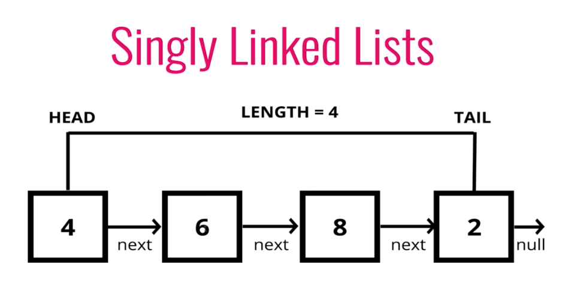

Lista Cykliczna
Graf skierowany / nieskierowany
Macierz graniczna pokazuje jakie wierzchołki są ze sobą połączone. Jest to tablica dwuwymiarowa o wielkości n, gdzie n jest ilością wierzchołków.
Cykl to jest ścieżka idąca przez wierzchołki grafów każdy jeden raz mp. 4 wierzchołki: 1-2, 2-3, 3-4, 4-1
Kopiec jest samobalansujący, ponieważ zanim utworzy kolejne piętro to zapełnia poprzednie

Sortowania:
wszystco co było z ich prędkością

stos
graf
lista łączona jedno/dwu kierunkowa
hashowanie / tablica hashująca

notacja BigO ?

# SORTOWANIE
> ## __Bubble / Bąbelkowe__
> ### __Złożoność:__ О(n&#178;)
> ### __Działanie:__ Sortowanie bąbelkowe wykonuje n przeszukań całej tablicy oraz n-1 porównań przy każdym przeszukaniu. Kręci się tak długo aż nie skończy się cała tablica 
> 
___
> ## __Insertion / Wstawianie__
> ### __Złożoność:__ О(n&#178;)
> ### __Działanie:__ Tworzy posortowaną tabelę element po elemencie, zaczynając szukając za każdym razem np. najmniejszego w całej tabeli a następnie pojedynczo przesuwa elementy do miejsca poprawnego umieszczenia o jeden w prawo.
> 
___
> ## __Selection / Wybieranie__
> ### __Złożoność:__ О(n&#178;)
> ### __Działanie:__ Ten algorytm sortowanie dzieli listę na części: "posortowana" i "do posortowania". Wyszukuje najmniejszy element w części "do posortowania" i dodaj do na koniec "posortowana" tak długo, jak "do posortowania" się nie skończy.
> 
___
> ## __Heap / Kopcowanie__
> ### __Złożoność:__ O(n log n )
> ### __Działanie:__ Sortowanie przez kopcowanie można podzielić na dwa etapy.
> ### 1. Z danych do posortowania tworzony jest kopiec 
> ### 2. Dane w kopcu są sortowane (MAX lub MIN)
> - Wpisujemy elementy jeden po drugim do kopca przy każdym dodaniu sprawdzając czy struktura kopca jest zachowana
> - Po utworzeniu kopca zmieniamy miejscami najmniejszy element (ostatni) kopca z największym (pierwszym)
> - Usuwamy nowy ostatni element przenosząc go do posortowanej tablicy i przywracamy struktórę kopca poprzez wynurzanie *chyba*?  
> 
## Porównanie szybkości sortowań na różnych rodzajach danych

# ALGORYTMY
## __Co to algorytm:__
### "Algorytm jest pewną ściśle określoną procedurą obliczeniową (ciągiem kroków), która dla odpowiednich danych wejściowych„produkuje” żądane dane wyjściowe, zwane wynikiem działania algorytmu."
## __Elementy specyfikacji algorytmu:__
- __Nazwa__ + lista argumentów w nawiasach
- __Wejście__ (warunek początkowy) – określa typy i dopuszczalne wartości poprawnych danych wejściowych
- __Wyjście__ (warunek końcowy) – określa prawidłowy wynik (typ i wartość) jaki ma być zwrócony przez algorytm jako funkcja danych wejściowych  

## __Sposoby przedstawienia algorytmu:__
- Opis w jęzuky naturalnym (zwykły opis jak człowiek człowiekowi)
- Schemat blokowy (rysunek jak na 1 sem WDA)
- Pseudokod (takie gówno co go nienawidzę)
# ZŁOŻONOŚĆ OBLICZENIOWA
> ## __Co to złożność obliczeniowa:__
> - _"Złożoność obliczeniowa algorytmu definiuje ilość zasobów potrzebnych do jego wykonania."_

> ## __Zasoby rozważane w analizie algorytmu:__

> - __Ilość wykorzystywanej pamięci__ _(złożoność pamięciowa)_ - zależność pomiędzy rozmiarem danych wejściowych a ilością wykorzystanej pamięci. 
> - __Czas działania__ _(złożoność czasowa)_ - zależność pomiędzy rozmiarem danych wejściowych a liczbą operacji elementarnych (dominujących) wykonywanych w trakcie przebiegu algorytmu.

> ## __Od czego zależy ilość wykorzystywanej pamięci:__
> - Od typów danych zmiennych i ich reprezentacji
> - Od struktur danych – ich rodzaju, rozmiaru

> ## __Od czego zależy czas działania algorytmu:__
> - Od zasobów sprzętowych, systemowych _(CPU, pamięć, itp.)_
> - __Rodzaju algorytmu__ dobranego do problemu _(np. sortowanie przez wstawianie vs. sortowanie szybkie)_
> - __Ilości danych wejściowych__ (sortowanie 10 vs. 1 miliona elementów),  czyli od __rozmiaru problemu__. Zwykle czas działania rośnie wraz z rozmiarem problemu
> - __Postaci danych wejściowych__ (np. stopnia posortowania ciągu wejściowego: już uporządkowany vs. porządek losowy)

> ## __Czas działania algorytmu mierzymy:__
> - manualnie lub automatycznie
> - za pomocą funkcji systemowych dla wybranych instancji zależnych od ilości danych, postaci danych, itp.

> ## __Złożoność pesymistyczna i średnia__
> - __złożoność pesymistyczna__ - definiowaną jako ilość zasobów komputerowych potrzebnych przy „najgorszych” danych wejściowych rozmiaru n. _Jest górną granicą możliwego czasu działania algorytmu dla każdych danych wejściowych_
> - __złożoność średnia__ - definiowaną jako ilość zasobów komputerowych potrzebnych przy „średnich” danych wejściowych rozmiaru n. _Jest to czas działania dla „średnich” danych wejściowych (zakładamy, że wszystkie dane wejściowe określonego rozmiaru są równie prawdopodobne)_

> ## __Notacja asymptotyczna__
> - __O(1)__ -> _(stała)_ -> operacje niezależne od rozmiaru zadania, np. przypisanie
> - __O(logn)__ -> _(logarytmiczna)_ -> algorytmy, w których zadanie o rozmiarze n sprowadzane jest do zadania rozmiaru n/2, plus pewna stała liczba działań (np. wyszukiwanie binarne w uporządkowanym ciągu)
> - __O(n)__ -> _(liniowa)_ -> algorytmy, w których wykonywana jest stała liczba działańdla każdego z n elementów (danych wejściowych)
> - __O(nlogn)__ -> _(logarytmiczna)_ -> algorytmy, w których zadanie o rozmiarze n zostaje sprowadzone do dwóch podzadań rozmiaru n/2, plus pewna liczba działań liniowa względem rozmiaru n, potrzebna do wykonania najpierw podzielenia, a następnie scalenia rozwiązań podzadań rozmiaru n/2 w rozwiązanie rozmiaru n
> - __O(n&#178;)__ -> _(kwadratowa)_ -> lgorytmy, w których jest wykonywana pewna stała liczba działań dla każdej pary danych wejściowych (podwójna iteracja)
> - __O(2&#8319;)__ -> _(wykładnicza)_ -> algorytmy, w których jest wykonywana stała liczba działań dla każdego podzbioru danych wejściowych
> - __O(n!)__ -> algorytmy, w których jest wykonywana stała liczba działań dla każdej permutacji danych wejściowych
> 

> 
> 
>
> http://home.agh.edu.pl/~horzyk/lectures/pi/ahdydpiwykl8.html#analizaalg

# STRUKTURY DANYCH

> ## Struktury danych mogą być:
> - Statyczne – nie zmieniają swojego rozmiaru ani struktury w trakcie działania algorytmu, np.
>   - Tablica
> - Dynamiczne – mogą zmieniać swój rozmiar i strukturę w trakcie działania algorytmu, np.
>   - Lista
>   - Drzewo
>   - Graf
___
> ## __Tablica__
> ### Czy dynamiczna? __NIE__
> ### Czy musi być posortowana? __NIE__
> ### Jednorodna struktura danych pozwalająca przechowywać obiekty tego samego typu, np. liczby całkowite, teksty, czy też bardziej złożone obiekty.
> ### Tablica może być:
> - Jednowymiarowa
> - Dwuwymiarowa
> - Wielowymiarowa
> ### Ma zadeklarowany z góry rozmiar
> ### Zwykle kolejne elementy znajdują się w kolejnych komórkach pamięci
___
> ## __Lista z dowiązaniami__
> 
> ### Czy dynamiczna? __TAK__
> ### Czy musi być posortowana? __NIE__
> ### Zbudowana jest z __węzłów__ i __dowiązań__.
> - __Węzeł__ - Zawiera dane określonego typu, a dokładniej referencję do komórki pamięci w których te dane są zapisane.
> - __Dowiązanie__ - Zawiera referencję do miejsca pamięci w którym następny węzeł jest zapisany.
> ### Lista z dowiązaniami może być:
> - Jednokierunkowa - Posiada odnośnik (referencję) do kolejnego węzła
> - Dwukierunkowa - Posiada odnośniki do kolejnego i poprzedniego węzła
> ### Lista z dowiązaniami posiada dwa wyróżnione wskaźniki:
> - Głowę - Wskazuje na początek listy czyli pierwszy element
> - Ogon - Wskazuje na koniec listy czyli ostatni element
> ### Możliwe sposoby implemnentacji:
> - lista z dowiązaniami
> - tablica
> ### __Lista może być cykliczna__ (dowiązanie do następnego z tail prowadzi do head lub poprzedniego z head to tail)
> ### Dostęp do elementów tablicy ma charakter sekwencyjny
> ### __Możliwe operacje:__
> - Wstawienie elementu
>   - Z przodu:  
> 
>   - Z tyłu:  
> 
> - Usuwanie elementu
> - Wyszukiwanie elementu
> - Znalezienie min/max elementu
> - Znalezienie poprzednika/następnika elementu
> - Sprawdzenie, czy lista jest pusta
> - Podanie rozmiaru listy
> ### __Lista a tablica__
> 
> 
___
> ## Kolejka
> 
> ### Czy dynamiczna? __TAK__
> ### Czy musi być posortowana? __NIE__
> ### Struktura danych przechowująca obiekty, funkcjonująca na zasadzie FIFO(<u>F</u>irst <u>I</u>n <u>F</u>irst <u>O</u>ut).
> ### __Możliwe operacje:__
> - konstruktor (utworzenie pustej kolejki)
> - Dodanie elementu (na koniec)
> - Pobranie elementu (z początku)
> - Liczba elementów
> - Sprawdzenie, czy pusta
> 
> 
> ### Kolejkę można zaimplementować przy pomocy:
> - listy z dowiązaniami
> - tablicy
> ### Kolejka posiada:
> - Głowę - head lub first _(wskaźnik do pierwszego elementu) (początek kolejki)_
> - Ogon - tail lub last _(wskaźnik do elementu ostatniego) (koniec kolejki)_
> ### Implementacja za pomocą listy:
> - enqueue() – nowy element wstawiamy na koniec listy (za dotychczasowy _last_)
> - dequeue() – zwracamy element z początku (wskazywanego dotychczas przez _first_, po wykonaniu operacji wskaźnik first będzie wskazywał na obecny drugi element)

> ## Stos
> 
> ### Czy dynamiczna? __TAK__
> ### Czy musi być posortowana? __NIE__
> ### Struktura danych przechowująca obiekty, funkcjonująca na zasadzie LIFO(<u>L</u>ast <u>I</u>n <u>F</u>irst <u>O</u>ut).
> ### Działa jak np. układanie książek w stos na biurku.
> ### __Możliwe operacje:__
> - konstruktor (utworzenie pustego stosu)
> - Dodanie elementu (na początek)
> - Pobranie elementu (z początku)
> - Pobranie rozmiaru
> - Sprawdzenie, czy pusta
> 
> 
___
___
# ODPOWIEDZI
> ## 1. Wyjaśnij pojęcia całkowitej i częściowej poprawności algorytmu. Podaj przykład prostego algorytmu, który jest częściowo poprawny, ale nie jest całkowicie poprawny.
> ### -> Można powiedzieć, że algorytm jest poprawny kiedy jest w pełni zgodny ze swoją specyfikacją. 
> ### --> np. Specyfikacja wymaga, aby:  
> a) wprowadzić dwie liczby typu int  
> b) wyliczyć ich sumę  
> c) napisać "Brawo!"  
> d) zwrócić wynik  
> ### __WSZYSTKIE__ te warunki muszą zostać spełnione, inaczej jest pprawność częściowa)  
> ### _Algorytm będzie częściowo poprawny jeżeli np. nie napisze "Brawo!"_
___
> ## 2. Czym jest złożoność obliczeniowa algorytmu? Jak ją mierzymy? Podaj złożoność algorytmów wyszukiwania sekwencyjnego oraz binarnego wyszukiwania elementu w posortowanej tablicy.
> ### -> Złożoność obliczeniowa jest ilością zasobów którą trzeba wykorzystać aby rozwiązać dany problem/algorytm. (dział "ZŁOŻONOŚĆ OBLICZENIOWA")
> ### Złożoność konkretnych wyszukiwań:  
> - ### binarne: O(logn)
> - ### sekwencyjne: O(n)
___
> ## 3. Wskaż podobieństwa i różnice między podstawowymi strukturami danych: kolejki i stosu. Jak wygląda interfejs obu struktur? W jakie sposób można te struktury implementować?
> ### Zasada działania:
> - __kolejka:__ FIFO
> - __stos:__ LIFO
> ### Obie struktury można zaimplementować przy użyciu:
> - listy z dowiązaniami
> - tablicy
___
> ## 4. Wyjaśnij istotę kolejki priorytetowej uwypuklając różnice w stosunku do podstawowej struktury kolejki? Jaki znasz sposoby jej implementacji? Wskaż zalety i wady każdego z nich.
> ### Kolejka zwykła:
> - Jest to struktura danych zawierająca elementy ułożone w kolejności dodania do kolejki.
> - Nie wiemy jaki _(w stosunku do innych elementów kolejki)_ jest element który obecnie będzie opuszczał kolejke ani do niej dołączał 
> ### Kolejka priorytetowa:
> - Jest to struktura danych zawierająca elementy ułożone w kolejności ważności priorytetu (max do min LUB min do max).
> - Wiemy, że element który obecnie będzie opuszczał kolejkę będzie zgodna z naszym priorytetem (od max do min LUB od min do max)
> ### Wady i zalety:
> - ZWYKŁA kolejka jest bardzo przydatna ze względu na tworzenie "spis działań do wykonania"
> - PRIORYTETOWA kolejka jest bardzo przydatna jeżeli chcemy zrobić "
> ### Sposoby implementacji:
> - tablica
> - lista powiązana
> - (TYLKO PRIORYTETOWA) kopiec binarny
___
## 5. Scharakteryzuj strukturę drzewa wyszukiwań binarnych. Podaj przykład. Jak go można wydajnie reprezentować? Dla podanych kluczy 20, 30, 60, 40, 50, 70, 10 narysuj drzewo, które powstanie po ich wstawieniu w podanej kolejności.
> ### Charakterystyka:
> - W korzeniu znajduje się pierwsza wartość
> - 
> 
___
> ## 6. Czym jest haszowanie i w jakim celu je stosujemy? Podaj przykład funkcji haszującej. Jak wygląda algorytm wyszukiwania oparty na haszowaniu?
> ### Metoda, w której pary (klucz, wartość) w tablicach wskazywane są na podstawie operacji arytmetycznych przekształcających klucze w indeksy tablicy.
> ### Pozwala ograniczyć do rozsądnej ilości potrzebny czas i pamięć. W algorytmach haszowania można zyskać czas kosztem pamięci (i na odwrót) dostosowując odpowiednio parametry, nie modyfikując kodu.
> ### Szukając klucza używamy ponownie hascode() (idealna funkcja hashująca przydzieli taki sam element do tej samej tablicy skrótów), aby sprawdzić gdzie dany element zostałby przypisany i sprawdza, czy w danej tablicy jest ten element.
___
> ## 7. Scharakteryzuj strukturę grafu. Wskaż różnice pomiędzy grafem nieskierowanym a skierowanym. Dla poniższego grafu podaj dwa możliwe sposoby jego reprezentowania. Wskaż zalety i wady każdego z nich.
> ### W grafie istnieją wierzchołki i krawędzie. Krawędź łączy dwa wierzchołki. Graf nieskierowany po prostu łączy dwa wierzchołki i pozwala na „przemieszczanie” się po grafie w dowolnym kierunku, natomiast graf skierowany ma w krawędziach określony początek i koniec, czyli można poruszać się tylko w wyznaczonym kierunku.
> ### Graf można reprezentować za pomocą:
> - __macierzy sąsiedztwa__ – zaletą jest przejrzystość krawędzi i czytelne przedstawienie grafu, wadą natomiast jest koszt pamięci
> - __tablicy list sąsiedztwa__ – zaletą jest mniejszy koszt pamięci ale w zamian do czytelnego przedstawienia grafu potrzeba dodatkowych pętli.