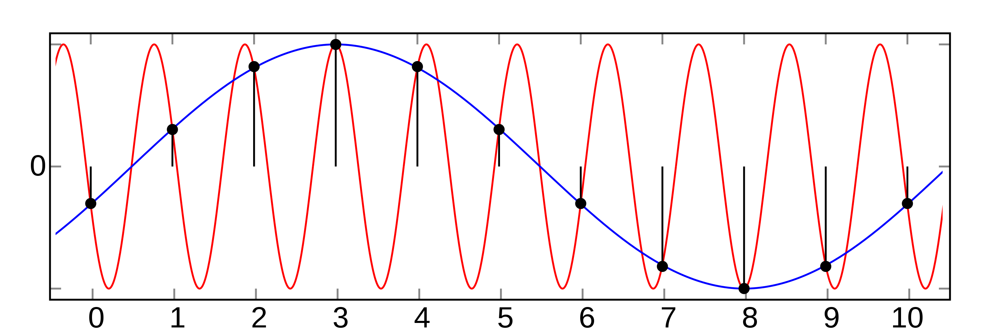
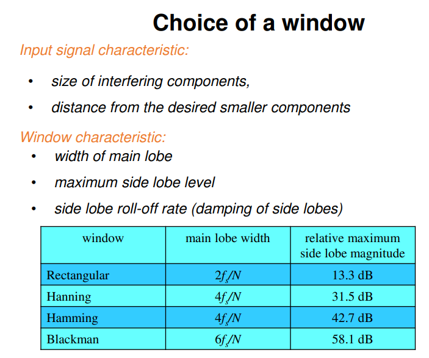
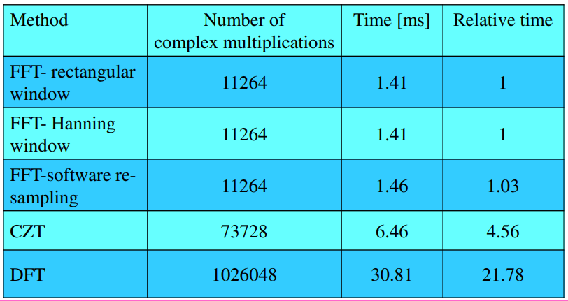

# 1. Powstawanie widma
- ## Powstaje kiedy częstotliwość sygnału wejściowego != Częstotliwość Nyquista lub jej wielokrotności
- ## Widmo można zmniejszyć używając:
    - ### Zwiększenie ilości danych wejściowych
    - ### Zastosowanie okienkowania (Hanning, Hamming, Prostokątne)
    - ### Spójne Próbkowanie - określa relację między:
        - Częstotliwością wejściową Fi
        - Częstotliwością próbkowania Fs
        - Ilością cykli w zestawie próbek
        - Ilością próbek.
        - Spójne próbkowanie zapewnia, że "signal power in an FFT is contained within one FFT bin"
# 2. Aliasing
- ## Jest to nieodwracalne zniekształcenie sygnału w procesie próbkowania wynikające z niespełnienia założeń twierdzenia o próbkowaniu. 
- ## Twierdzenie o próbkowaniu polega na tym, że nasza częstotliwość próbkowania musi być dwa razy większa od częśtotliwości Nyquista, czyli najwyższej ważnej częśtotliwości w sygnale.

# 3. Charakterystyka okien (ocena ich)

# 4. Kiedy FFT, kiedy CZT, kiedy DFT
- ## DFT używamy, kiedy znacznie ważniejsza od czasu realizacji analizy sygnału jej jego dokładność. ( O (n^2) )
- ## FFT używamy, kiedy znacznie ważniejsz od dokładności analizy sygnału jest jej szybkość ( O (n log(n) ) )
- ## Obecne procesory są na tyle mocne, że umożliwiają wykorzystanie CZT (Chirp Z-Transform, Tranfsormata Świergotowa) która jest jedynie około 4 razy wolniejsza od FFT jednak jest niemal tak dokładna jak DFT (złoty środek).

# 5. Struktura przetwarzania sygnałow
- ## Próbkowanie
    - ### Próbkowanie, czyli pobieranie próbek x(tn) analogowego sygnału x(t) w dyskretnych chwilach tn.
    - ### Zazwyczaj sygnały są próbkowane równomiernie.
    - ### Aby sygnał spróbkowany można było dalej przetwarzać cyfrowo, zbiór wartości próbek musi być zbiorem skończonym.
- ## Kwantyzacja
    - ### Przetwarza sygnał spróbkowany w sygnał o dyskretnej strukturze amplitudowej.
    - ### Polega ona na podzieleniu zakresu zmian wartości sygnału na skończoną liczbę M przedziałów kwantyzacji i przybliżeniu wartości chwilowych próbek wartościami przyporządkowanymi poszczególnym przedziałom.
    - ### Operacja kwantowania wprowadza specyficzny błąd do procesu przetwarzania sygnału nazywany błędem kwantowania.
- ## Kodowanie
    - ### W wyniku kwantowania sygnału dyskretnego przedział zmian jego wartości zostaje podzielony na M = 2^b przedziałów kwantyzacji. Przedziały te można wówczas zakodować słowami binarnymi o długości b.