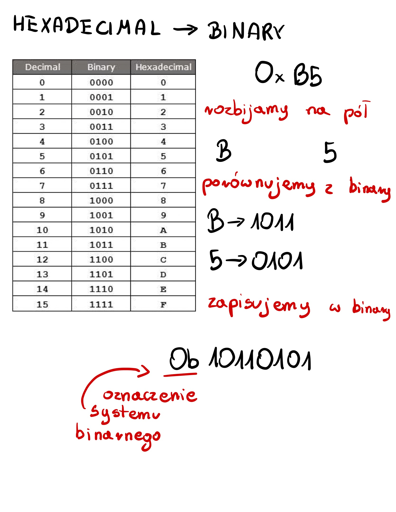
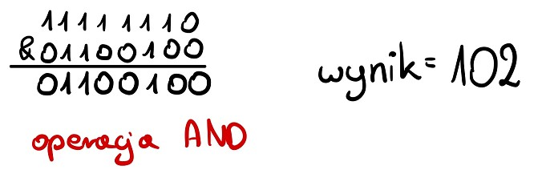
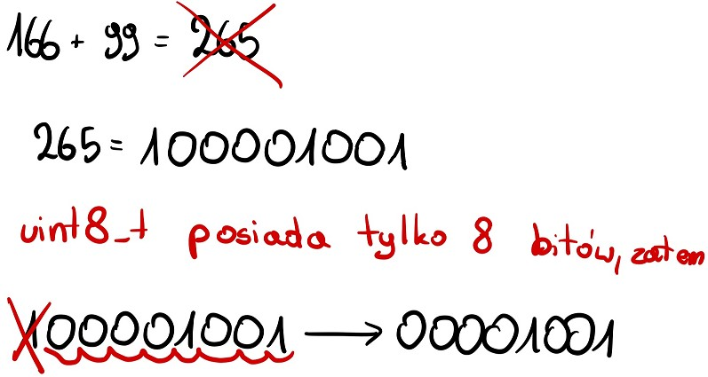
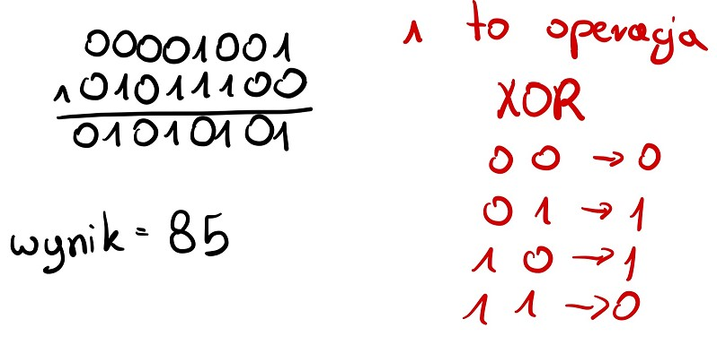

# 1. Stwórz typ osoba (przepis na strukturę) która zawiera imię, nazwisko oraz numer indeksu. Stwórz funkcję , wyświetlającą zawartość tej struktury. Na podstawie stworzonego typu zadeklaruj 2 struktury. Jedną stałą, która będzie która będzie zawierała twoje dane, a jedną zmienną, wyświetlającą informację o twoim najlepszym wyimaginowanym przyjacielu. Następnie wywołaj funkcję wyświetlającą na obu strukturach. Pomiń wszystkie #include.

```C
typedef struct osoba {        // tworzymy strukturę (typ) osoba posiadającą:
    char imie[20];            // tablicę znaków "imie" o długości 20
    char nazwisko[40];        // tablicę znaków "nazwisko" odługości 40
    uint16_t nr;              // int na numer indeksu o długości 16 (WAŻNE)
};

void wypisz(struct *osoba wypisywany) {         // tworzymy funkcję wypisującą jedną osobę przyjmującą WSKAŹNIK do tej osoby
    printf("%s", wypisywany->imie);             // printujemy imie z wypisywanego jako string
    printf("\n%s", wypisywany->nazwisko);       // printujemy nazwisko z wypisywanego jako string
    printf("\n%d", wypisywany->nr);             // printujemy nr z wypisywanego jako digit
}

const struct osoba ja = {           // tworzymy strukturę siebie
    .imie = "Adrian",               // przypisujemy 'string' imię
    .nazwisko = "Stankiewicz",      // przypisujemy 'string' nazwisko
    .nr = 47576                     // przypisujemy int nr
};

int main(void) {                    // teraz trzeba to wszystko wywołać w main
    struct osoba przyjaciel = {     // tworzymy strukturę naszego ziomeczka
        .imie = "Jajami",           // przypisujemy 'string' imie
        .nazwisko = "O'Mate",       // przypisujemy 'string' nazwisko
        .nr = 007                   // przypisujemy int nr
    }

    // WAŻNE!!
    // Metoda wypisz() przyjmuje wskaźnik, także musimy podać & przed nazwą!!!

    wypisz(&ja);                    // wywołujemy funkcję wypisz() do siebie
    wypisz(&przyjaciel);            // wywołujemy funkcję wypisz() do przyjaciela
    
    return 0;           // kończymy program returnem 0, bo tak się po prostu robi
}
```
___
# 2. Uzupełnij komórki tak, aby każda liczba była przedstawiona w systemie dziesiętnym, heksadecymalnym i binarnym.

| Decimal | Hexadecimal | Binary         |
|:--------|:------------|:---------------|
| _243_   | __0xF3__    | _0b11110011_   |
| _202_   | _0xCA_      | __0b11001010__ |
| __181__ | _0xB5_      | _0b10110101_   |
| _235_   | __0xEB__    | _0b11101011_   |
| _101_   | _0x65_      | __0b01100101__ |
| __214__ | _0xD6_      | _0b11010110_   |
| __73__  | _0x49_      | _0b01001001_   |
| _25_    | __0x19__    | _0b00011001_   |


___

___

___

___
# 3. Wykonaj te operacje i podaj wynik w systemie dziesiętnym:
## a) uint8_t a = ((9 / 2) | (6 << 4)) & ~1
> ## 9/2 = 4      <-- dzielenie całkowite (brak reszty)
> ## 6 << 4 = 96  <-- pszesunięcie binarne o 4 w lewo
> 
> ## Następnie robimy OR między 4 (00000100)a 96 (01100000):
> ## 00->0 , 01->1 , 10->1 , 11->1 
> 
> ## Następnie musimy zanegować (odwrócić wszystkie bity) w 1:
> 
> ## I na koniec robimy AND między ~1 i wynikiem OR
> ## 00->0 , 01->0 , 10->0 , 11->1
> 
## b) uint8_t b = (166 + 99) ^ 0x5C
> ## uint8_t potrafi zapisać maksymalnie 8 bitów. Wynikiem dodawania 166+99 jest 265, zatem jest to liczba 9 bitowa - nastąpi przepełnienie.
> 
> ## Następnie zmieniamy 0x5C w wartość binarną (tak jest najprościej)
> 
> ## ^ oznacza operację XOR między wynikiem dodawania (00001001) a 0x5C (01011100)
> 
## c) uint8_t c = (((uint16 t)166 + 99) >> 1)
> ### mimo, że uint8_t przyjmuje wartość maksymalną 255, to dzięki rzutowaniu dodawania na uint16_t nie ma przepełnienia:
>> #### ((uint16 t)166 + 99) = 265
> ### Następnie przesuwamy wynik dodawania o jeden bit w prawo:
>> #### zapis binarny 265 to 100001001
>> #### 100001001 >> 1 = 010000100 = 10000100
>> #### zapis dziesiętny 10000100 to 132
> 
___
# 4. Dysponując poniższą implementacją hardware'ową napisz program, który gasi diodę w momencie wciśnięcia przysicku. Wykorzystanym mikrokontrolerem ma być Atmega328P. Pomiń wszystkie #include oraz #define F_CPU. (15 pkt)

___
# 5. Ponizszy kod powinien wyświetlać kolejno znaki z ciagu znaków "exam". Popraw błędy w kodzie, jeżeli wystepuja. (4pkt)
```C
// KOD BŁĘDNY
char str[] = "\0exam\0";
char *p = str;
while(p) {
    printf("%s", *p) ;
    p++;
}
```
```C
// KOD POPRAWNY
char str[] = "exam\0";  // "\0" to oznaczenie końca ciągu znaków.
                        // Umieszczamy go jedynie na końcu, nie na początku 
char *p = str;
while(*p) {             // "*p" to odniesienie do wskaźnika
                        // pętla while potrafi operować w taki sposób jedynie na Boolean lub wskaźniku, nie na typie char

    printf("%c", *p) ;  // "%c" to skrót od character, a "%s" od string.
                        // Ten program ma wypisywać kolejno ciąg znaków, a nie całe słowo co obrót, więc musimy to zmienić 
    p++;
}
```
___
# 6. Odpowiedz na jedno z ponizszych pytań. (6pkt)
## -  Czym jest pre-compilator i do czego słuzy?
## - Dlaczego warto uczyc sie jezyka C? (4pkt)
## - Czy w jezyku C możemy pracowac na obiektach i tancuchach znaków?

### Nie, poniewaz język C nie jest językiem obiektowym. Łańcuch znaków (String) domyślnie jest obiektem, zatem równiez go nie ma.
### Da się natomiast pracować na wskaźnikach do tablicy znaków i tablicach znaków. Np. w printf("%s", char[]) mozna wypisacć całą tablicę niczym string.
### Co prawda C nie posiada __domyślnie__ obiektów, ale posiada struktury. Możemy dzięki nim tworzyć paraobiekty, które do wielu zastosować są wystarczające (np. osoba w Zad1).
## - Czy i dlaczego w jezyku C standardowo wystepuja struktury/obiekty dynamiczne?
___
# 7. Jaki układ scalony można nazwać układem mikroprocesorowym?